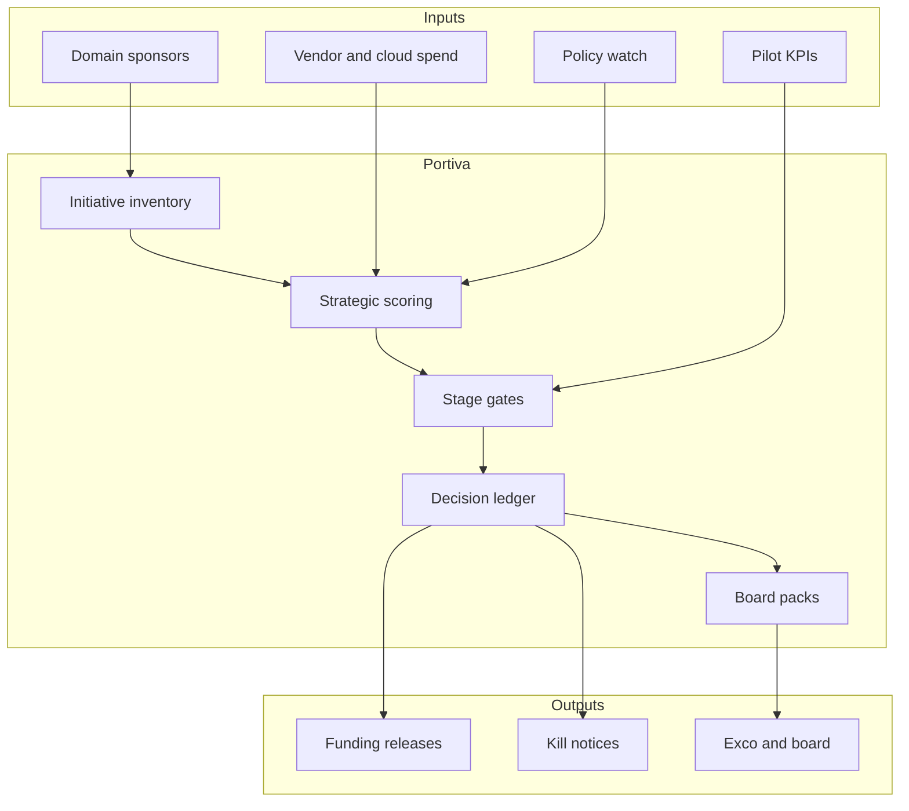

# Portiva

**Source:** `ai-in-financial/Deloitte_WEF_FS_AI_Summary_2018/`
**Domain:** `ai-fin`
**One-liner:** An executive AI opportunity portfolio and operating-model decision system that helps financial institutions pick, fund, sequence, and govern AI bets across value creation, operations, competition, and policy—without confusing a pilot catalogue for a strategy.
**Wedge:** Group CIO / Chief Strategy / FS transformation offices at mid-to-large banks and insurers that have dozens of AI pilots and need a WEF-aligned portfolio with kill criteria, data-moat logic, and policy watch items.
**Positioning:** WEF FS AI opportunity portfolio OS. Deloitte and the Forum summarise how AI reshapes building blocks of success (scale of data, tailored experiences, matching, retention benefits, augmented performance) and raise executive questions across four arcs; Portiva turns those arcs into an investable portfolio. Distinct from Autara (self-driving personal finance execution), Alliora (fintech alliance shopping), and Ordovex (desk risk controls).

## Market research synthesis

### Thesis from source

This Deloitte summary of the World Economic Forum report *The New Physics of Financial Services* synthesises ten months of workshops and 200+ expert interviews. It defines AI functionally as technologies with adaptive predictive power and autonomous learning that advance pattern recognition, foresight, rule creation, decision making, and communication. The strategic claim: AI transforms the historical building blocks of FS success—from scale of assets, mass production, exclusivity, high switching costs, and pure human ingenuity—toward scale of data, tailored experiences, optimisation/matching, high retention benefits, and augmented performance.

Four upheaval arcs structure the brief. **Value creation:** old levers of price/speed/access weaken; new levers are customisation, engagement beyond FS (e.g. RBC dealer demand forecasting beside lending), and curated ecosystems (Lloyds’ multi-billion digital strategy; Ping An’s 880M users / 70M businesses / 300 partners). Self-driving finance appears as an AI agent that advises on complex decisions and automates routine ones—while accountability for algorithm-driven decisions remains unsettled (Portiva tracks that as policy risk; Autara productises the agent itself elsewhere). **Operating models:** AI turns centres of excellence into sellable services (BlackRock Aladdin revenue ambitions; Ping An OneConnect to ~500 banks), while cloud/microservices (IDC: 80% of app development on cloud microservices by 2021; cloud ~one-third of FS IT spend, >20% CAGR) enable plug-and-play—and raise systemic concentration risk. **Competition:** markets bifurcate toward scale players and niche innovators; mid-tier hollows out (48% of >$50B banks deployed AI vs 7% of $1–10B banks). **Public policy:** norms for humans, machines, and infrastructure lag the tech.

The product insight: executives do not need another trend book; they need a living portfolio that scores opportunities on data advantage, defensibility, talent dependency, concentration/vendor risk, and policy exposure—with explicit fund/kill/scale decisions.

### Buyer & economic model

- **Primary buyer:** Chief Strategy Officer, Group CIO, or Head of AI Transformation.
- **Users:** portfolio PMO, domain sponsors (retail, markets, ops), model/risk governance liaisons, finance partners for business-case tracking, board risk committee (read-only packs).
- **Budget owner / value metric:** transformation and AI investment budget. Value metric is capital recycled from killed pilots and time-to-scale for bets that clear gates.
- **Competing status quo:** slide inventories of 40 pilots; innovation theatre; vendor-led roadmaps; no link between WEF-style strategic arcs and quarterly funding.

### Domain constraints

- **Regulatory / trust / safety:** board accountability for AI; model risk; conduct when automation scales misconduct; competition and data-sharing constraints when collaborating with rivals/tech firms.
- **Data sensitivity:** portfolio contents reveal strategic intent; access must be tightly role-gated.
- **Change-management realities:** business units defend pet pilots; Portiva must make kill criteria pre-agreed and evidence-based to depoliticise stops.

## Business requirements

- BR-1: Every AI initiative must map to at least one strategic arc (value creation, operating model, competition, public policy) and a named economic buyer.
- BR-2: Initiatives must declare data-moat assumptions (unique data, virtuous cycle potential) and fail review if the moat is “none” without a niche strategy label.
- BR-3: Funding stages (explore / pilot / scale / CoE-as-a-service) must have pre-declared kill metrics; missed kills require executive exception.
- BR-4: Vendor and big-tech dependency must be scored; concentration risk across critical systems must be visible at portfolio level.
- BR-5: Talent and reskilling needs must be attached to each scale decision so ops efficiency plays do not silently strand capacity for growth plays.
- BR-6: Policy watch items (accountability for automated advice, data localisation, competition remedies) must block scale when unresolved beyond a threshold.
- BR-7: Mid-tier vs scale competitive posture must be explicit—copying scale-player plays without data scale should surface as a warning.
- BR-8: Portfolio reporting must show spend, expected value, risk, and stage in one board pack—not separate innovation and risk decks.
- BR-9: Externalisation candidates (turn internal CoE into a service) must follow a distinct diligence path including data-sharing constraints.
- BR-10: Decisions (fund, kill, scale, pause) must be immutable with rationale and dissenting notes.
- BR-11: The system must prevent double-counting overlapping pilots that chase the same customer outcome.
- BR-12: Portiva must not execute customer financial actions—it governs institutional bets only (no overlap with Autara’s agent).

## User stories

Canonical user stories live in sibling [USER_STORIES.md](USER_STORIES.md).

## System design

### Overview

Portiva maintains an initiative inventory mapped to WEF arcs, scores strategic fitness (moat, talent, vendor, policy), runs stage-gate funding workflows with kill criteria, and produces board/exco packs. It integrates loosely with finance systems for actuals and with model inventories for risk tags—but does not run models or customer agents.

### Actors & boundaries

- **Actors:** CSO, CIO, sponsors, PMO, finance, risk/conduct, board readers.
- **Trust boundary:** portfolio secrecy within the institution; vendors do not see competitor-sensitive scores.
- **Human-in-the-loop points:** every fund/kill/scale decision; policy-blocker waivers.

### Core capabilities

1. **Initiative inventory** — arc mapping, owners, outcomes.
2. **Strategic scoring** — moat, talent, vendor, policy, competitive posture.
3. **Stage-gate funding** — explore/pilot/scale/CoE with kill metrics.
4. **Overlap detection** — same customer outcome clustering.
5. **Dependency and concentration views**.
6. **Policy watchlist** — blockers and waivers.
7. **Board pack generation**.
8. **Decision ledger** — immutable fund/kill/scale records.

### Conceptual data

- **Primary entities:** Initiative, StrategicArc, Scorecard, StageGate, KillMetric, FundingDecision, VendorDependency, PolicyWatchItem, OverlapCluster, BoardPack.
- **Critical events:** initiative filed, scored, gated, funded, killed, scaled, waiver granted, pack published.
- **Retention / audit needs:** decision ledger retained for board and regulatory strategy inquiries; commercial forecasts retained with version history.

### Integrations (conceptual)

- **Systems of record:** finance actuals, HR workforce plans, model risk inventory, vendor management.
- **Upstream signals:** pilot KPIs, cloud spend, model incident tags.
- **Downstream actions:** budget releases, kill notices, board packs, risk-committee papers.

### High-level architecture

### Success metrics

- **Leading:** % initiatives with complete scorecards; kill-metric enforcement rate; overlap clusters resolved; policy blockers cleared before scale.
- **Lagging:** capital recycled from kills; time-to-scale for successful bets; reduction in unmanaged pilot count; board satisfaction with AI oversight packs.

## OpenAPI skeleton

Canonical HTTP surface lives under [packages/openapi-core/src/](packages/openapi-core/src/) — see [OPENAPI.md](OPENAPI.md). Summary:

- **Base path:** `/v1/...`
- **Auth:** Bearer JWT for executives and PMO; `X-API-Key` for KPI ingestion.
- **Resource groups:** Initiatives, Scorecards, Gates, Decisions, Dependencies, PolicyWatch, BoardPacks.
