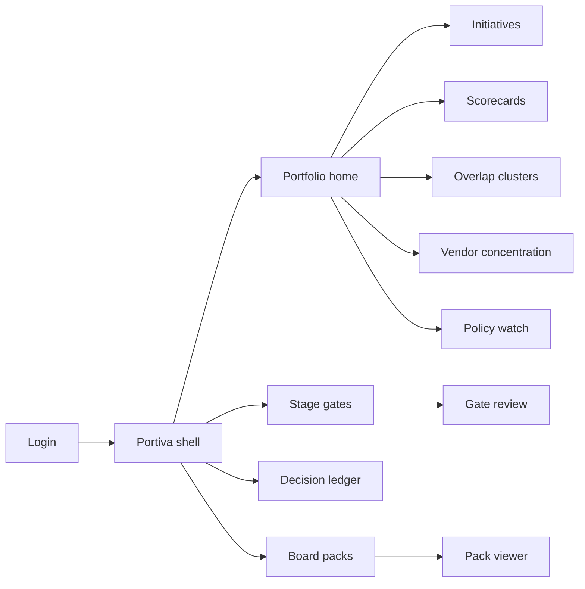
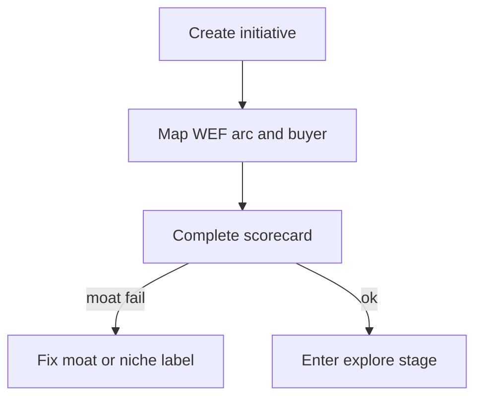
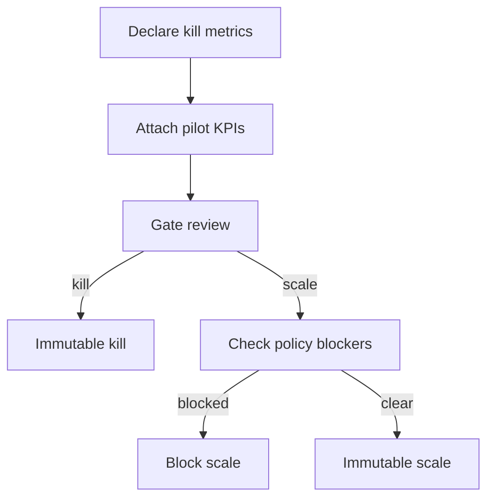

# Portiva — Web app

**Product:** [PRODUCT.md](./PRODUCT.md)
**Primary surface:** Executive AI portfolio and stage-gate console (CSO / CIO / PMO / sponsor workspaces)
**Secondary surfaces:** Board/exco read-only pack viewer; finance actuals sync status (read-only)
**Design thesis:** Portiva is a capital allocation chamber for AI bets — the UI metaphor is a portfolio scoreboard and irreversible decision ledger, not an innovation lab wall of pilot posters. Visual language is cool navy and brass on chalk-white panels: funded bets feel committed; kill decisions feel final and dated; policy blockers feel like red gates before scale. The Portiva wordmark sits as a quiet mint of authority on every board pack and decision screen so executives know whose portfolio truth they are arguing from.

## UX research synthesis

### Category peers (best-in-class)

- **Productboard / Aha! (portfolio prioritisation):** Outcome-linked initiatives, scoring, and roadmap views that force trade-offs. Steal: scorecard-driven ranking and explicit stage progression; reject consumer-product roadmap metaphors that ignore FS policy and vendor concentration.
- **ServiceNow Strategic Portfolio / Clarity PPM:** Stage-gate funding, kill/continue discipline, and executive rollups. Steal: pre-declared gate criteria and immutable decision records; reject IT-ticket aesthetics as the primary chrome.
- **BlackRock Aladdin-style risk rollups (executive lens):** Single pack that mixes exposure, dependency, and narrative for fiduciaries. Steal: one board composition for spend + risk + stage (BR-8); reject trading-desk density for strategy users.
- **Model inventory / MRM portals (bank internal patterns):** Policy and accountability tags before production. Steal: policy blockers visible before scale; reject burying conduct risk in a separate compliance silo.

### Patterns to adopt / reject

- **Adopt:** Four WEF arcs as first-class taxonomy; data-moat declaration mandatory; kill metrics pre-agreed at gate entry; vendor concentration heat at portfolio level; talent demand rollup on scale; policy watch as hard blockers; overlap clusters for same customer outcome; immutable fund/kill/scale ledger with dissent notes.
- **Reject:** Pilot poster walls; “AI maturity radar” vanity charts without funding decisions; purple insight bots that invent strategy; editable historical decisions; dashboard that mixes customer execution with portfolio governance (BR-12).

### Trust, density, and workflow constraints from PRODUCT.md

Strategic intent is confidential — role-gated portfolio secrecy (domain constraint). Kill criteria must be pre-agreed to depoliticise stops (BR-3). Moat “none” without niche label fails review (BR-2). Policy unresolved beyond threshold blocks scale (BR-6). Mid-tier copying scale plays without data scale warns (BR-7). Board needs one pack, not split innovation/risk decks (BR-8). Overlaps must not double-count capital (BR-11). Portiva never executes customer financial actions (BR-12).

## Information architecture

### Nav model

### Roles → default home

| Role | Default home | Why |
|------|--------------|-----|
| Chief strategy officer | Portfolio home — arc heat + capital at risk | Stop theatre (BR-1, BR-8) |
| CIO / head of AI | Vendor concentration + talent rollup | Systemic dependency (BR-4, BR-5) |
| Domain sponsor | My initiatives / propose | Fair capital competition |
| Portfolio PMO | Stage gates queue | Enforce kill metrics (BR-3) |
| Model risk / conduct liaison | Policy watch blockers | Block scale surprises (BR-6) |
| CFO partner | Realised vs expected by stage | Recycle capital |
| Board risk committee | Board pack viewer | One-page oversight |

### Cross-links to OpenAPI resources

| Nav area | OpenAPI tags / resources |
|----------|---------------------------|
| Initiatives | Initiatives |
| Scorecards | Scorecards |
| Stage gates | Gates |
| Fund / kill / scale | Decisions |
| Vendor / concentration | Dependencies |
| Policy blockers | PolicyWatch |
| Exco / board packs | BoardPacks |

## Screen inventory

### Portfolio home

- **Purpose:** Answer “where is AI capital, and which bets should die or scale this quarter?” in one composition.
- **Entry:** CSO/CIO default post-login.
- **Layout regions:** Brand + role chrome; arc heatmap (value creation / operating model / competition / public policy); spend vs expected value strip; stage distribution; kill-due and policy-blocked counts; top initiatives table; alerts rail (overlaps, concentration spikes).
- **Primary actions:** Open initiative; open gates due; generate board pack; resolve overlap cluster.
- **Empty / loading / error:** Empty = guided “file first initiative with arc + buyer”; loading = skeleton heat + table; error = retry with request id.
- **BR / story ties:** BR-1, BR-8; CSO stories.

### Initiative inventory

- **Purpose:** Living catalogue mapped to arcs, economic buyers, and customer outcomes — not a slide dump.
- **Entry:** Nav → Initiatives; from home table.
- **Layout regions:** Filterable table (arc, stage, sponsor, moat grade, policy status, overlap flag); bulk merge for overlaps; create drawer with mandatory arc + buyer.
- **Primary actions:** Create; merge overlaps; archive killed; export inventory.
- **Empty / loading / error:** Validation blocks save without arc/buyer (BR-1).
- **BR / story ties:** BR-1, BR-11; sponsor stories.

### Initiative detail

- **Purpose:** Single bet record: thesis, outcome metric, scorecard, gates, dependencies, policy tags, decision history.
- **Entry:** From inventory or gate queue.
- **Layout regions:** Header (arc badges, stage, owner); thesis and value metric; scorecard panel; gate timeline; vendor deps; policy watch links; decision ledger slice; dissent notes.
- **Primary actions:** Submit to next gate; request kill exception; open CoE-as-a-service diligence path (BR-9).
- **Empty / loading / error:** Incomplete scorecard blocks gate submit.
- **BR / story ties:** BR-2–BR-7, BR-9, BR-10.

### Strategic scorecard

- **Purpose:** Score data moat, talent, vendor, policy, competitive posture; fail “none” moat without niche label.
- **Entry:** Initiative → Scorecard; portfolio scoring queue.
- **Layout regions:** Dimension scores with rationale fields; moat declaration; mid-tier warning banner when copying scale plays without data scale; concentration contribution preview.
- **Primary actions:** Save score; flag for CIO review; attach evidence links.
- **Empty / loading / error:** Moat none + no niche = hard fail state (BR-2, BR-7).
- **BR / story ties:** BR-2, BR-4, BR-5, BR-7.

### Stage-gate workspace

- **Purpose:** Explore / pilot / scale / CoE-as-a-service with pre-declared kill metrics and exception path.
- **Entry:** Nav → Gates; PMO home.
- **Layout regions:** Gate queue by due date; criteria checklist; KPI evidence pane; kill-metric status; exception request panel.
- **Primary actions:** Pass; kill; pause; grant executive exception (audited).
- **Empty / loading / error:** Missing kill metrics = cannot enter gate (BR-3).
- **BR / story ties:** BR-3; CSO and PMO stories.

### Decision ledger

- **Purpose:** Immutable fund / kill / scale / pause records with rationale and dissenting notes.
- **Entry:** Nav → Decisions; initiative history.
- **Layout regions:** Append-only table; decision detail drawer; dissent thread (non-editable after lock); export for board.
- **Primary actions:** Record decision (from gate); export ledger slice.
- **Empty / loading / error:** Settled rows visually locked; no edit affordance (BR-10).
- **BR / story ties:** BR-10.

### Overlap clusters

- **Purpose:** Detect pilots chasing the same customer outcome; force merge or kill to stop double-counting.
- **Entry:** Portfolio alerts; dedicated nav.
- **Layout regions:** Cluster cards with shared outcome label; member initiatives; capital at risk if both continue.
- **Primary actions:** Merge; kill member; keep with documented differentiation.
- **Empty / loading / error:** Empty = “no unresolved overlaps”.
- **BR / story ties:** BR-11; CFO partner stories.

### Vendor concentration

- **Purpose:** Portfolio-level dependency on cloud/model/vendor so systemic outsourcing is visible.
- **Entry:** CIO default secondary; Dependencies nav.
- **Layout regions:** Concentration heat by vendor/capability; initiative drill-down; critical-system flags.
- **Primary actions:** Open dependent initiatives; attach mitigation; escalate to board pack.
- **Empty / loading / error:** Unscored deps = amber incomplete banner (BR-4).
- **BR / story ties:** BR-4; CIO stories.

### Policy watch

- **Purpose:** Accountability, localisation, competition remedies as blockers before scale.
- **Entry:** Conduct/MRM home; initiative policy panel.
- **Layout regions:** Watchlist items; threshold status; linked initiatives blocked from scale; waiver log.
- **Primary actions:** Clear blocker; request waiver; tag self-driving-advice accountability gap.
- **Empty / loading / error:** Unresolved beyond threshold = coral block on scale gate (BR-6).
- **BR / story ties:** BR-6; model risk / conduct stories.

### Talent and reskilling rollup

- **Purpose:** Aggregate talent demand from scale decisions so ops take-out does not strand growth capacity.
- **Entry:** From CIO home or scale gate context.
- **Layout regions:** Demand by skill; initiatives driving demand; HR plan sync status.
- **Primary actions:** Export to workforce plan; flag gap before scale approve.
- **Empty / loading / error:** Missing talent attachment blocks scale submit (BR-5).
- **BR / story ties:** BR-5.

### CoE-as-a-service diligence

- **Purpose:** Distinct path for externalising internal CoE including data-sharing constraints.
- **Entry:** Initiative flagged as externalisation candidate (BR-9).
- **Layout regions:** Diligence checklist; data-sharing constraints; revenue thesis; risk committee notes.
- **Primary actions:** Advance diligence; reject externalisation; promote to board pack section.
- **Empty / loading / error:** Incomplete diligence blocks “service” stage.
- **BR / story ties:** BR-9; operations sponsor stories.

### Board pack builder and viewer

- **Purpose:** One pack: spend, expected value, risk, stage — not separate innovation and risk decks.
- **Entry:** CSO action; board reader login.
- **Layout regions:** Pack outline; heat map page; decision summary; concentration and policy excerpts; publish/version history; read-only viewer for board.
- **Primary actions:** Generate; publish; download PDF; comment (board = view only).
- **Empty / loading / error:** Stale actuals = warning banner, not silent publish.
- **BR / story ties:** BR-8; board and CFO stories.

## Key flows

1. **File and score a bet** — create initiative with arc + buyer → complete scorecard (moat, talent, vendor, policy, posture) → enter explore; failure: moat none without niche.

2. **Stage-gate kill or scale** — pre-declare kill metrics → evidence at gate → pass/kill/pause → immutable decision; failure: missed kill needs executive exception.

3. **Resolve overlap cluster** — detect same outcome → merge or kill member → capital no longer double-counted (BR-11).

4. **Board pack publish** — pull spend/value/risk/stage → concentration + policy excerpts → publish version → board read-only (BR-8).

5. **Policy waiver path** — blocker beyond threshold → dual-control waiver with rationale → still visible on pack; or clear blocker before scale.

## Design system

### Tokens (CSS variables)

- `--color-ink: #0F1A24` — primary text
- `--color-chalk: #F4F6F8` — panel ground
- `--color-navy: #0B1F33` — shell / brand ground
- `--color-brass: #B08D57` — committed funding / brand accent
- `--color-gate-red: #C24B3A` — kill / policy block
- `--color-amber: #D4A017` — exception / provisional
- `--color-ledger-teal: #2F6F6A` — passed gate / scaled confirmation
- `--color-steel: #5C6B7A` — secondary labels
- `--font-display: "Newsreader", "Source Serif 4", serif` — portfolio titles and board pack headlines
- `--font-body: "IBM Plex Sans", sans-serif` — console chrome
- `--font-mono: "IBM Plex Mono", monospace` — decision ids, pack versions
- `--space-1`…`--space-8`: 4px scale
- `--radius-sm: 4px`; `--radius-md: 8px` — institutional, not pill-heavy
- `--motion-decide: 180ms ease-out` — decision lock flash
- `--motion-block: 240ms ease-in-out` — policy gate pulse
- `--motion-pack: 200ms ease-out` — pack publish confirm
- Atmosphere: chalk panels on navy shell; subtle brass rules; board-pack paper density; no purple AI nebula, no startup “innovation lab” photo walls.

### Typography & brand

- Display serif for pack titles and arc labels; Plex Sans for tables; mono for decision and pack version ids.
- Portiva wordmark left of shell on portfolio and decision views; board pack cover treats brand as hero-level seal, not a footer logo.
- Login: brand + one headline (“Fund, kill, and scale AI bets on evidence”); one CTA — no pilot carousel.

### Do / don’t

- **Do:** Lock decisions visually; show kill metrics before gate entry; put policy blockers on the scale path; one board composition for money and risk; warn mid-tier scale-copy plays.
- **Don’t:** Purple AI glow; editable ledger history; vanity maturity radars as home; customer-transaction screens; emoji stage pills; card grids of pilots without scores.

### Accessibility & domain trust cues

- Contrast AA+ on brass/teal/red against navy and chalk; decisions also show lock icon + timestamp text.
- Live regions announce gate due, kill exception, and policy block changes.
- Focus order follows capital flow: initiative → scorecard → gate → decision → pack.
- Board viewer respects reduced motion; pack export is keyboard-complete.

## Component patterns

- **ArcHeatMap** — four WEF arcs with capital and risk density.
- **MoatDeclarationField** — mandatory moat + niche label fail state.
- **KillMetricChecklist** — pre-declared criteria bound to a gate.
- **DecisionLedgerRow** — immutable fund/kill/scale/pause with dissent affordance.
- **PolicyBlockBanner** — scale-blocking watch item with threshold.
- **ConcentrationHeat** — vendor/capability systemic exposure.
- **OverlapClusterCard** — same-outcome members and capital-at-risk.
- **TalentDemandRollup** — skills demanded by scale decisions.
- **CoeDiligencePath** — externalisation checklist with data-sharing constraints.
- **BoardPackComposer** — single spend/value/risk/stage pack publisher.

## Out of scope for v1 web

- Running or monitoring production ML models; customer-facing self-driving finance agents (Autara); vendor marketplace procurement checkout; native mobile trading; public WEF content CMS; multi-bank consortium sharing of portfolio secrets.
